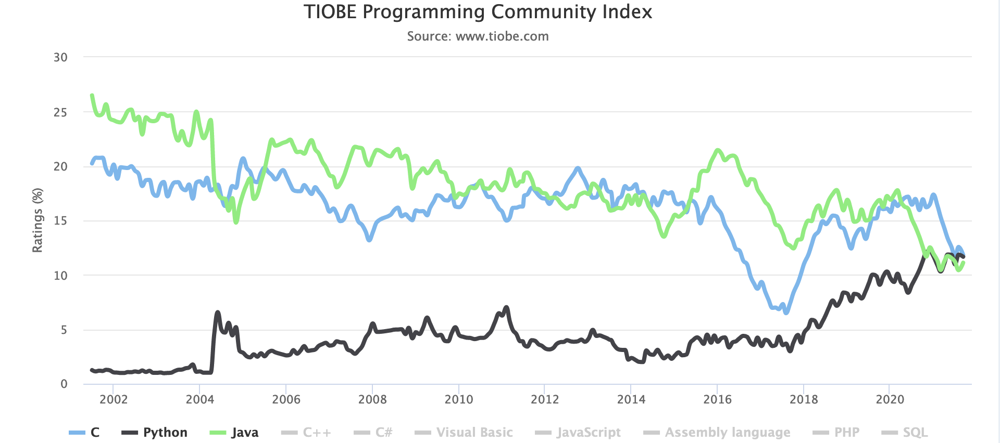

# Why Python ?

## 1. About python 

[Python](https://www.python.org/about/) is a widely-used **high-level programming** language created by Guido van Rossum and first released in 1991. In the last decade, Python became one of the most popular language: according to [TIOBE](https://www.tiobe.com/tiobe-index/) programming community, since 2021 Python is the second most popular language just behind C language (a low-level programming). With only 0.16\% difference, Python has never been so close to the number 1 position of the TIOBE index (historically only C and Java have been leading the pack so far). This index is calculated by popular search engines (e.g. Google, Bing, Yahoo!, Wikipedia, Amazon, YouTube and Baidu).

If we only take account on how often programming language tutorials are searched on Google, Python is currently the most popular language according to [PYPL](https://www.tiobe.com/tiobe-index/)

## 2. Evolution of the language in the last 20 years 

What makes this language so popular ?

## 3. Some pros and cons 

We enumerate some of the (non-exhaustive) **reasons of its popularity**:

1. **The syntax**. As a high-level programming language, python is simple and intuitive. Most of them are simply English words;

2. Python is **free** and **open-source**;

3. Python has an **extensive support libraries/packages**. With both standard libraries of Python and external libraries from the *Python package index (PyPi)*, you can find almost all the functions needed for your task (more than 200 000 packages);

4. Python is a **multi-purpose language**. Indeed this language is well adapted for scientific computing (e.g. statistics, data science and machine learning), web and internet development, software development, etc. This is very useful since scientists interact with other domains of computer science;

5. Python is an **Object Oriented Programming** (OOP) language. Therefore it is more structured and maintained efficiently, especially for big projects;

6. Python is an **interpretable language**. It means that it directly executes the code line by line. This process helps to debug the code more easily since it shows only one error per execution (even if there are many errors in the program);

7. Python is a **dynamically-typed language**. Python doesn’t know the type of variable until we run the code. It automatically assigns the data type during execution. The programmer doesn’t need to worry about declaring variables and their data types;

8. Python is **very appreciated by companies**. Python integrates well with other software components that can be used to build an *end to end pipeline* (a pipeline is a set of automated processes that allow developers and DevOps professionals to reliably and efficiently compile, build, and deploy their code to their production platforms). This is one of the reason why this language is well-used in most of the big companies. Google has made python one of its main programming language;

9. <b>Last but not least:</b> The community. Often you can easily find answers to your questions in Python forums, blogs and/or lectures. Python is continuously improving with the help of its community members;

However, Python has also **some drawbacks**.

1. Python has **less packages** than Matlab and R *in their own domain of research*;

2. Python can be **quite slow**. As discussed above Python is an interpreted and dynamically-typed language. The line by line execution of code often leads to slow execution and the dynamic nature of Python leads to do the extra work while executing code;

3. Python is **not memory efficient** (e.g. compared to C). To provide more simplicity, each variable in Python acts as an *object* therefore using a large amount of memory. Hence, combined with the slow process power, it is weak in mobile computing.

4. Difficulties to **access databases**. Python fell behind when it comes to access the data in comparison to the popular technologies like JDBC.

**Note that these drawbacks can be (partially) solved by external packages or technologies.**
